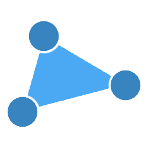
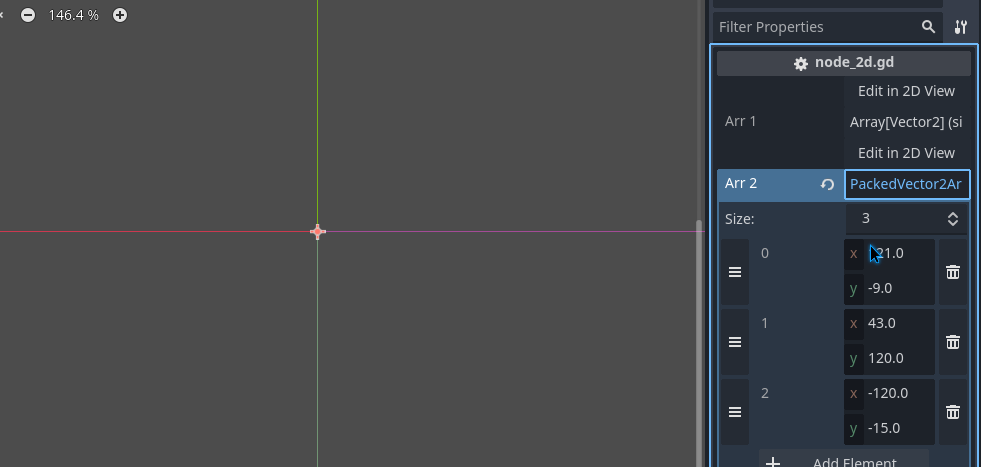
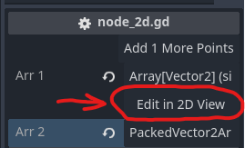
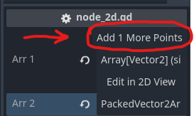

<p align="center">
  
</p>

<h1 align="center">
  Godot Vector2Editor Plugin
</h1>


## About

This plugin allows you to edit `Array[Vector2]` and `PackedVector2Array` as polygon shape.


## Demo Preview 




## Features

- Easy to use
- Edit `Array[Vector2]` and `PackedVector2Array` with power of polygons editing
- support for CanvasItem nodes (Node2D, Control and any of their subtype)
- Doesn't impact project performance or complexity


## Requirements 

- Godot 4.2 or higher
  

## Installation

- Open the `AssetLib` tab in Godot with your project open.
- Search for "Vector2 array editor" and install the plugin by Mero.
- Open project settings -> plugins, and enable the plugin `Vector2ArrayEditor`.
- Done!


## Usage

> [!WARNING]
> Make sure to check [Troubleshooting](#Troubleshooting) section

```gdscript 
# in your Node2D script

@export var arr1: Array[Vector2]
@export var arr2: PackedVector2Array
```

- select any node in your scene with exported `Array[Vector2]` or `PackedVector2Array` property type

- click "Edit in 2D view" button in the inspector right above your property to enter edit mode 



- if there is less then 3 items in your array the button will add missing points (it won't override existing ones)




## Troubleshooting

- plugin support only CanvasItem nodes, e.g. Node2D, Control and any of their subtype. For all the other the edit btn will be blocked 
- plugin support only 
- 
